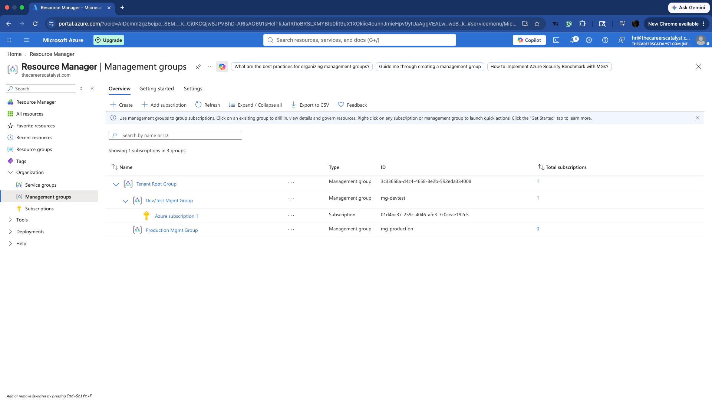
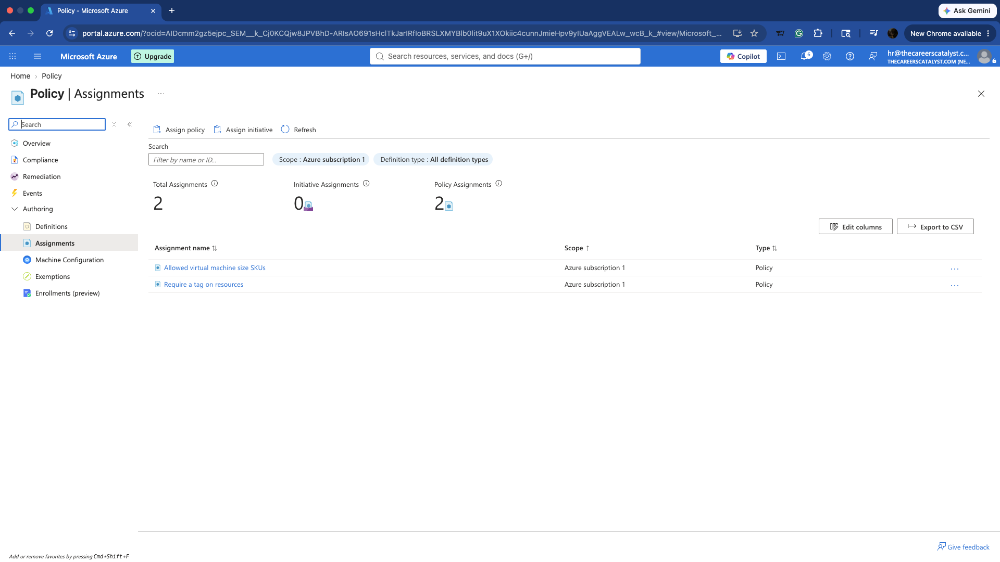
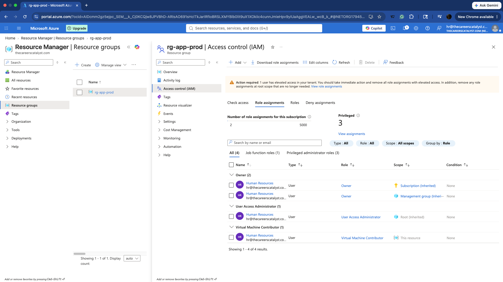
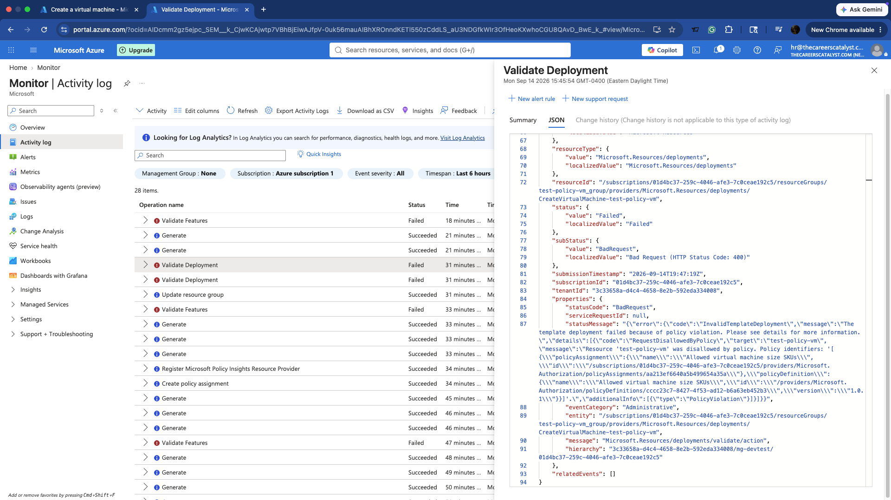
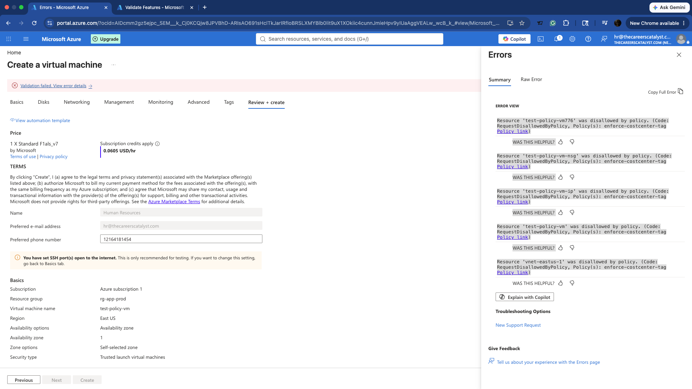
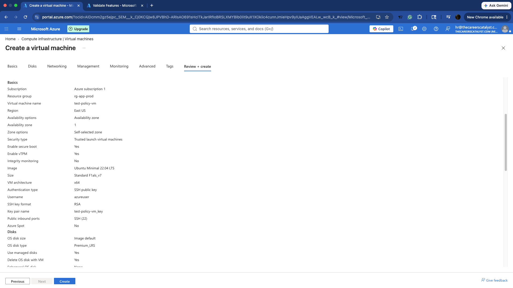
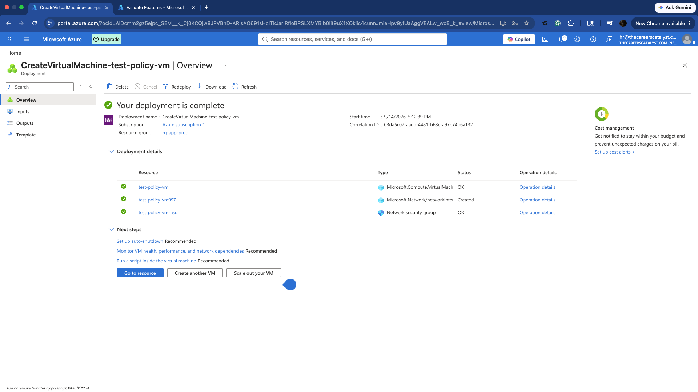
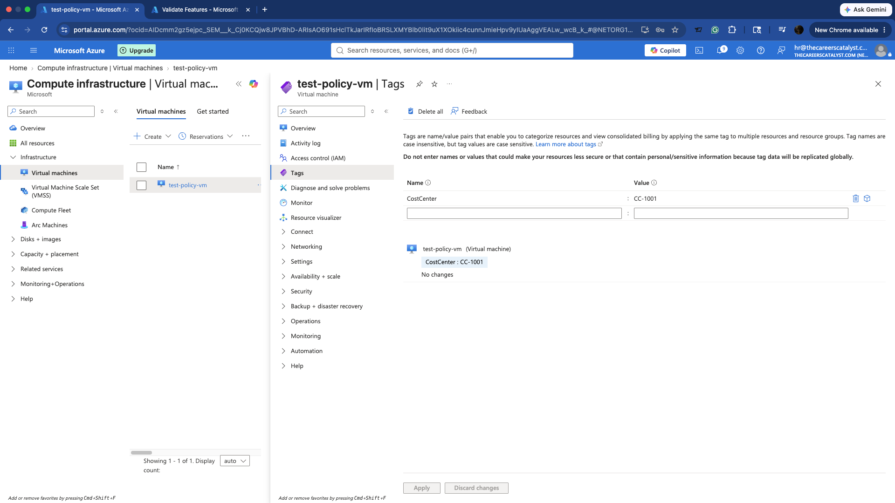

# Azure Governance, RBAC & Policy Enforcement Lab

## Project Overview

This project demonstrates the implementation of Azure governance and access control using Management Groups, Role-Based Access Control (RBAC), and Azure Policy.

The lab simulates an enterprise governance environment where Azure resources must follow organizational security and compliance requirements before deployment is permitted.

### Key Objectives

- Create a Management Group hierarchy for centralized governance
- Implement Role-Based Access Control (RBAC)
- Enforce approved Virtual Machine sizes using Azure Policy
- Require a `CostCenter` tag on deployed resources
- Test policy enforcement using a non-compliant VM deployment
- Correct policy violations and successfully deploy a compliant VM
- Verify resource tagging and policy compliance

## Technologies Used

- Microsoft Azure
- Azure Management Groups
- Azure Role-Based Access Control (RBAC)
- Azure Policy
- Azure Virtual Machines
- Azure Resource Manager

## Governance Architecture

The Azure environment was organized using Management Groups to demonstrate centralized governance across subscriptions.

The hierarchy included:

- **Tenant Root Group**
  - **Dev/Test Management Group**
    - Azure Subscription
  - **Production Management Group**

This structure provides a foundation for applying governance controls at different organizational scopes.

### Management Group Hierarchy

## Azure Policy Implementation

Two Azure Policy controls were implemented to enforce deployment standards:

1. **Allowed Virtual Machine Size SKUs** — restricts VM deployments to approved compute sizes.
2. **Require a Tag on Resources** — requires resources to contain the designated `CostCenter` tag.

### Policy Assignments

## Role-Based Access Control (RBAC)

Azure Role-Based Access Control (RBAC) was used to demonstrate least-privilege access management.

A **Virtual Machine Contributor** role assignment was configured at the appropriate Azure scope. This demonstrates how Azure permissions can be assigned based on job responsibilities rather than providing unrestricted administrative access.

### RBAC Role Assignment

## Policy Enforcement Testing

The governance controls were tested by intentionally attempting deployments that did not meet the configured Azure Policy requirements.

This demonstrated that Azure Policy can prevent non-compliant resources from being deployed before they enter the environment.

### VM Size Policy Enforcement

A VM deployment using a non-approved VM size was blocked by the **Allowed Virtual Machine Size SKUs** policy.

### Required CostCenter Tag Enforcement

A deployment that did not satisfy the required `CostCenter` tagging policy was also blocked.

## Remediation and Successful Deployment

After Azure Policy blocked the non-compliant deployment attempts, the VM configuration was updated to satisfy the governance requirements.

An approved VM size was selected and the required `CostCenter` tag was applied.

### Policy-Compliant VM Configuration

The VM configuration was updated to use an allowed VM size.

### Successful VM Deployment

After correcting the policy violations, the VM deployment completed successfully.

### CostCenter Tag Verification

The deployed VM was verified to contain the required `CostCenter` tag, demonstrating compliance with the organization's tagging requirement.

## Governance and Security Principles

This lab demonstrated several core Azure governance and security concepts:

- **Centralized governance:** Management Groups provide a hierarchy for organizing subscriptions and applying governance controls at scale.
- **Least-privilege access:** RBAC allows users and administrators to receive only the permissions required for their responsibilities.
- **Preventive governance:** Azure Policy can deny resource deployments that do not meet organizational standards.
- **Standardized compute:** VM size restrictions can help organizations control which compute resources are permitted.
- **Resource organization:** Required tags such as `CostCenter` help support resource ownership, organization, and cost management.
- **Compliance remediation:** Non-compliant configurations can be identified, corrected, and redeployed according to organizational requirements.

## Troubleshooting and Validation

During testing, Azure Policy intentionally prevented VM deployments that did not satisfy the configured governance requirements.

The first policy enforcement test demonstrated that a VM using a non-approved SKU could not be deployed. A separate test demonstrated enforcement of the required `CostCenter` tag.

I reviewed the policy-related deployment errors, corrected the VM configuration to satisfy the applicable requirements, and successfully deployed the VM.

The final deployment and resource tags were then reviewed in the Azure Portal to verify that the corrected configuration met the lab's governance requirements.

## What I Learned

Through this project, I gained hands-on experience with:

- Designing an Azure Management Group hierarchy
- Understanding governance scope and inheritance
- Assigning Azure RBAC roles
- Applying least-privilege access principles
- Creating and assigning Azure Policy controls
- Restricting allowed VM sizes
- Enforcing required resource tags
- Reading Azure Policy deployment errors
- Troubleshooting policy-denied deployments
- Remediating configuration issues
- Validating successful resource deployment and tagging

## Resource Cleanup

After completing and documenting the lab, the Azure resources created for testing were deleted to prevent unnecessary cloud charges.

The screenshots in this repository preserve evidence of the governance configuration, policy enforcement tests, remediation process, and successful deployment.

